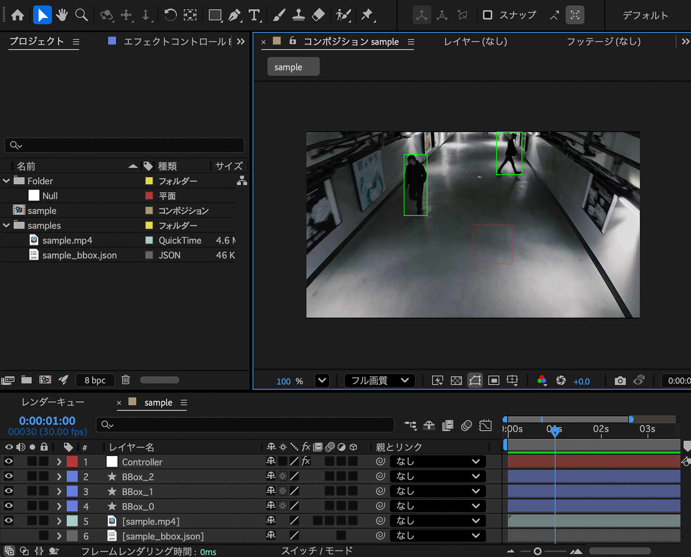

# AE_AnsysBBoxViewer

**Current Version:** v1.0.1 (JSON-driven)



AE_AnsysBBoxViewer is an After Effects script that visualizes Python-based video analysis results using bounding boxes imported from JSON files.

It is designed for workflows where object detection or tracking is performed in Python, and the results are reviewed and refined visually inside After Effects.

## Legacy Version

`ae/legacy/AE_AnsysBBoxViewer_v1.0.0.jsx` is provided as a minimal, non-JSON example for reference and learning purposes.

---

## Quick Start (Recommended)

The easiest way to generate JSON files is to use **Google Colab**.  
No local Python environment setup is required.

**Workflow:**

1. Run the Google Colab notebook  
2. Upload an MP4 file  
3. Download the generated JSON file  
4. Import the JSON into After Effects  
5. Visualize bounding boxes using AE_AnsysBBoxViewer  

👉 **Run on Google Colab:**  
https://colab.research.google.com/github/nameshigawa/AE_AnsysBBoxViewer/blob/main/python/colab/ansys_video_colab.ipynb

> Run the script, select an MP4 file, and the JSON file will be downloaded automatically.

---

## Features

- Visualize bounding boxes from Python-generated JSON data
- Frame-accurate playback synchronized with composition FPS
- Support for multiple bounding boxes using layer name IDs (`BBox_0`, `BBox_1`, …)
- Automatic hiding of bounding boxes when no data exists
- Language-independent expressions (compatible with all After Effects UI languages)

---

## How to Use (After Effects)

1. Import the analyzed MP4 file into After Effects.
2. Create a composition based on the MP4  
   (matching resolution, FPS, and duration).
3. Import the JSON file generated by the Python analysis.
4. Run `AE_AnsysBBoxViewer.jsx`.
5. In the **Controller** layer, assign the JSON file using `JSON_Footage`.
6. Duplicate the BBox shape layer and rename it with an ID number  
   (`BBox_0`, `BBox_1`, `BBox_2`, …) to display multiple bounding boxes.

> 💡 The number in the layer name corresponds to the `id` field in the JSON data.

---

## JSON Format

The script expects the following JSON structure:

```json
[
  [
    {
      "id": 0,
      "x": 398,
      "y": 611,
      "width": 62,
      "height": 108,
      "label": "person",
      "conf": 0.52
    }
  ]
]
```

- The top-level array represents frames in time order.
- Bounding boxes are indexed per frame starting from 0.
- Shape layer names must include a zero-based numeric ID
  that matches the `id` field (e.g. Box_0, Box_1).
- If no bounding box exists for a given ID in a frame,
  the corresponding shape layer will be hidden automatically.
- Additional fields such as tracking IDs or custom metadata
  can be included and will be ignored by the viewer if not used.

### Bounding Box Fields

- `id`     : Zero-based bounding-box identifier
- `x`, `y` : Top-left position of the bounding box
- `width`  : Width of the bounding box
- `height` : Height of the bounding box
- `label`  : Class label (e.g. "person")
- `conf`   : Detection confidence (0.0 – 1.0)

## Roadmap

- v1.1.0: Advanced bounding-box control
  - Automatic shape layer duplication by ID
  - Label-based color coding
  - Confidence threshold and visibility control

- v2.0.0: Annotation overlay
  - Label and confidence text display
  - Text layers following bounding boxes
  - UI-style visualization
